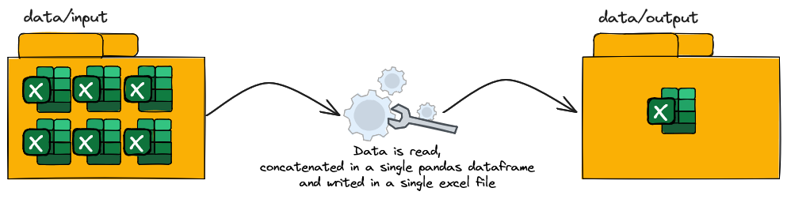

# Simple Excel Data Pipeline

What this project does:

## How this project is structered ?

- **.github/workflows/ci.yml** — Configuration file for continuous integration, defines automated GitHub actions.
- **app** — Main application code.
- **data** — Directory for storing input/output files
- **docs** — Documentation of the project.
- **tests** — Automated tests for the project's modules.
- **.gitignore** — List of files and directories ignored in the test context.
- **.python-version** — Specifies the version of Python used in the project.
- **mkdocs.yml** — Configuration file for the MkDocs tool, used to generate project documentation.
- **pyproject.toml** — Configuration file for Python project and dependency management tools.
- **README.md** — Initial description and instructions for the repository.

# Tools Used in This Project

1. **GitHub Actions**: This is a CI/CD tool that helps automate your software development workflows right from within GitHub. You can set up workflows in your repository to build, test, package, release, or deploy any code project on GitHub. Configured in `.github/workflows/ci.yml`.

2. **MkDocs**: This is a fast, simple and downright gorgeous static site generator that's geared towards building project documentation. Documentation source files are written in Markdown, and configured with a single YAML configuration file `mkdocs.yml`.

4. **Poetry**: The `pyproject.toml` file is a configuration file for Python project and dependency management tools. In this project, we are using Poetry as our dependency management tool. Poetry provides a simple and efficient way to manage project dependencies and virtual environments. It allows you to declare your project dependencies in a `pyproject.toml` file and easily install, update, and remove them using the Poetry command-line interface.
